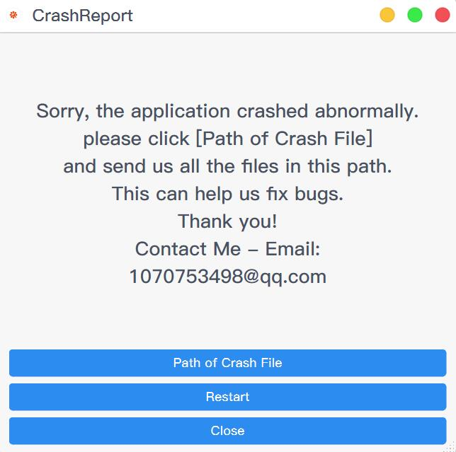

# Qt-App

-   [Simplified Chinese](README.md)
-   [English](README.en.md)

> Image resources and other sources come from the Internet.
> This code warehouse is for learning only. If it is used for commercial purposes by others, it has nothing to do with me! Please abide by the license!

## Qt-App

-   A plug-in-developed desktop application framework that can be used to quickly develop desktop applications;[qt-creator/src/libs/extensionsystem at master · qt-creator/qt-creator (github.com)](https://github.com/qt-creator/qt-creator/tree/master/src/libs/extensionsystem)；
-   Cooperate[vcpkg](https://github.com/microsoft/vcpkg)Use it;
-   Support at the same time[cmake](.github/workflows/cmake.yml)and[qmake](.github/workflows/qmake.yml)Compile;
-   [Supports native Apple Silicon compilation;](#问题和备注)
-   support[actions](.github/workflows/cmake.yml)Compile, package, publish;

<div align="center">

</div>

## CrashReport

Crash reporting procedure;

<div align="center">

</div>

## Code structure

1.  [cmake](cmake): Encapsulated CMake utility function;
    1.  [utils](cmake/utils.cmake): Practical functions;
2.  [docs](docs): Document description and pictures;
3.  [examples](examples): Sample code;
4.  [packaging](packaging): Packaging and publishing;
5.  [src](src): Source code;

    1.  [3rdparty](src/3rdparty): Third-party library;
        1.  [qtlockedfile](src/3rdparty/qtlockedfile): Qt file lock;
        2.  [qtsingleapplication](src/3rdparty/qtsingleapplication): Qt single instance;

    2.  [aggregate](src/aggregate):polymerization;

    3.  [apps](src/apps):app;
        1.  [app](src/apps/app)：Qt-App；
        2.  [crashreport](src/apps/crashreport)：CrashReport；

    4.  [core](src/core): Plugins are inherited from this;

    5.  [dump](src/dump): Crash capture function;

        1.  [Breakpad](src/dump/breakpad.hpp): Crash capture based on Google Breakpad encapsulation;
        2.  [crashpad](src/dump/crashpad.hpp): Crash capture based on Google Crashpad encapsulation;

            > Under Unix system, it may be necessary`crashpad_handler`Grant execution permissions, otherwise it will not start normally.

            ```bash
            chmod +x crashpad_handler
            ```

    6.  [extensionsystem](src/extensionsystem): Plugin system, the code comes from Qt-Creator, and some modifications have been made;

    7.  [gui](src/gui): Encapsulated interface components;

    8.  [plugins](src/plugins): Plugin;
        1.  [aboutplugin](src/plugins/aboutplugin):About plug-ins;
        2.  [coreplugin](src/plugins/coreplugin): Core plug-ins, main interface, menu, toolbar, status bar, settings, plug-in manager, etc.;
        3.  [guiplugin](src/plugins/guiplugin): GUI plug-in, some GUI components customized based on QSS style;
        4.  [hashplugin](src/plugins/hashplugin): hash plug-in, hash algorithm provided by QT;
        5.  [helloplugin](src/plugins/helloplugin): Hello plug-in, used for testing plug-in development;
        6.  [systeminfoplugin](src/plugins/systeminfoplugin): System information plug-in;

    9.  [resource](resource): Pictures and QSS files;

    10. [utils](utils): Tool function encapsulation;
6.  [translations](translations): Translate the file;

## Questions and Notes

-   > The move function under ubuntu wayland desktop is invalid;
    >
    > 1.  Need to add it at the beginning of the main function`qputenv("QT_QPA_PLATFORM", "xcb");`This problem can be solved;

-   > MacOS, cmake generated bundle, not generated under .app/Contents/ folder`PkgInfo`document;
    >
    > 1.  [app/CMakeLists](/apps/app/CMakeLists.txt), using this CMakeLists.txt can generate bundles on MacOS, and the icons can be displayed normally, but there is no PkgInfo file;
    > 2.  How to generate a PkgInfo file in cmake?
    >     1.  Using WireShark`set_source_files_properties(${CMAKE_CURRENT_SOURCE_DIR}/PkgInfo PROPERTIES MACOSX_PACKAGE_LOCATION .)`Similarly, copy it to the bundle;
    > 3.  qmake will generate PkgInfo file by default, you only need to specify it`TARGET=app`or`CONFIG+=bundle`Just do it;

-   > Under Unix systems, it is necessary to use static libraries as much as possible to avoid the dependency problem of dynamic libraries;
    >
    > 1.  There are several modules in this project that are dynamic libraries because they are plugins and require dynamic loading;
    > 2.  Then you need to package these dynamic libraries, then load them at runtime, and you also need to rpath`"-Wl,-rpath,\'\$$ORIGIN\':\'\$$ORIGIN/lib\':'\$$ORIGIN/../lib'")`, set it, otherwise the dynamic library will not be found;
    > 3.  Or use install_name_tool(macos) and patchelf/chrpath(linux) to modify the dependency path of the dynamic library, which is very troublesome;
    > 4.  Also consider that these libraries can be shared, so don't re-package them;
    > 5.  You can see for details[workflows](.github/workflows/cmake.yml)；

-   > MacOS，[vcpkg](https://github.com/microsoft/vcpkg)Compiling third-party library issues;
    >
    > 1.  because[vcpkg](https://github.com/microsoft/vcpkg)at present[Only support for individual compilation of x64-osx and arm64-osx](https://github.com/microsoft/vcpkg/discussions/19454)；
    > 2.  In use[cmake](.github/workflows/cmake.yml)When specifying`CMAKE_OSX_ARCHITECTURES=x86_64`or`CMAKE_OSX_ARCHITECTURES=arm64`;
    > 3.  In use[qmake](.github/workflows/qmake.yml)When specifying`QMAKE_APPLE_DEVICE_ARCHS=x86_64`or`QMAKE_APPLE_DEVICE_ARCHS=arm64`；

-   > International real-time translation. The translation settings are currently changed and the program needs to be restarted before it can take effect;
    >
    > 1.  Update the translation command

        ```bash
         cmake --build build --target Qt-App_lupdate
        ```

    2.  I'm too lazy to change the code;
    3.  [Specific reference: QT practical tips (update when you think of it)](https://realchuan.github.io/2021/10/12/QT%E5%AE%9E%E7%94%A8%E5%B0%8F%E6%8A%80%E5%B7%A7%EF%BC%88%E6%83%B3%E5%88%B0%E5%B0%B1%E6%9B%B4%E6%96%B0%EF%BC%89/), core code;

        ```cpp
        void Widget::changeEvent(QEvent *e)
        {
           QWidget::changeEvent(e);
           switch (e->type()) {
           case QEvent::LanguageChange:
              comboBox->setItemText(0, tr("Hello"));
              label->setText(tr("Hello")); // 代码添加的文字
              ui->retranslateUi(this);     // 有UI文件情况下
              break;
           default: break;
           }
        }
        ```
