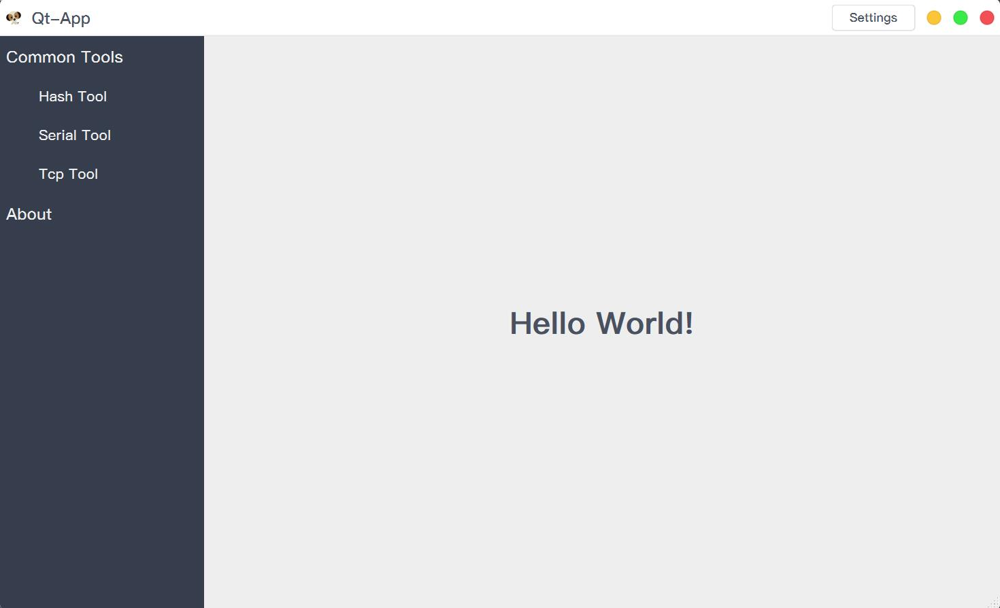

# Qt-App

-   [Simplified Chinese](README.md)
-   [English](README.en.md)

Picture resources and so on come from the Internet.
This code warehouse is for learning only, if it is used by others for commercial purposes, it has nothing to do with me! Please obey the license!

## Qt-App

A desktop application framework developed based on plug-ins, which can be used to quickly develop desktop applications;[qt-creator/src/libs/extensionsystem at master · qt-creator/qt-creator (github.com)](https://github.com/qt-creator/qt-creator/tree/master/src/libs/extensionsystem)；

## CrashReport

Crash Reporter;

## code structure

1.  [3rdparty](3rdparty): third-party library;
    1.  [qtlockedfile](3rdparty/qtlockedfile): Qt file lock;
    2.  [qtsingleapplication](3rdparty/qtsingleapplication): Qt single instance;
    3.  [breakpad](3rdparty/breakpad.hpp): Crash capture based on Google Breakpad package;
2.  [aggregate](aggregate):polymerization;
3.  [apps](apps):application;
    1.  [app](apps/app)：Qt-App；
    2.  [crashreport](apps/crashreport)：CrashReport；
4.  [cmake](cmake): Encapsulated CMake utility function;
    1.  [utils](cmake/utils.cmake): utility function;
5.  [core](core): All plugins inherit from this;
6.  [extensionsystem](extensionsystem): Plug-in system, the code comes from Qt-Creator, with some modifications;
7.  [gui](gui): encapsulated interface components;
8.  [plugins](plugins): plugin;
    1.  [coreplugin](plugins/coreplugin): Core plugin, main interface, menu, toolbar, status bar, settings, plugin manager, etc.;
    2.  [serialplugin](plugins/serialplugin): serial plug-in;
    3.  [tcpplugin](plugins/tcpplugin): TCP plugin;
9.  [resource](resource): pictures and QSS files;
10. [utils](utils): utility function package;

## Questions and Notes

1.  MacOS, the bundle generated by cmake is not generated under the .app/Contents/ folder`PkgInfo`document;
    1.  [app/CMakeLists](/apps/app/CMakeLists.txt), using this CMakeLists.txt can generate bundles on MacOS, and can also display icons normally, but there is no PkgInfo file;
    2.  How should cmake generate PkgInfo files?
    3.  qmake will generate PkgInfo file by default, only need to specify`TARGET=app`or`CONFIG+=bundle`can;
2.  Under the Unix system, it is necessary to use the static library as much as possible to avoid the dependency problem of the dynamic library;
    1.  Several modules in this project are dynamic libraries, because they are plugins, they need to be loaded dynamically;
    2.  Then you need to package these dynamic libraries, and then load them at runtime, and you also need to rpath`"-Wl,-rpath,\'\$$ORIGIN\':\'\$$ORIGIN/lib\':'\$$ORIGIN/../lib'")`, make settings, otherwise the dynamic library will not be found;
    3.  Or use install_name_tool (macos), patchelf/chrpath (linux) to modify the dependency path of the dynamic library, which is very troublesome;
    4.  Also consider that these libraries can be shared, so don't pack them repeatedly;
    5.  You can see the details[workflows](.github/workflows/cmake.yml)；
