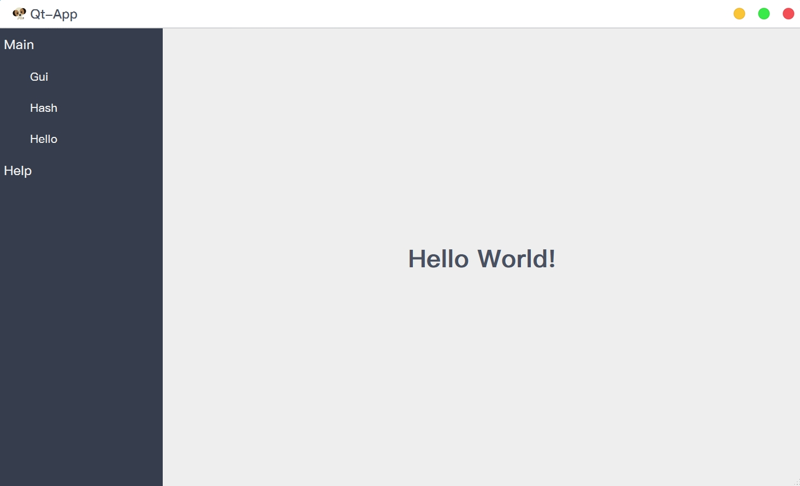
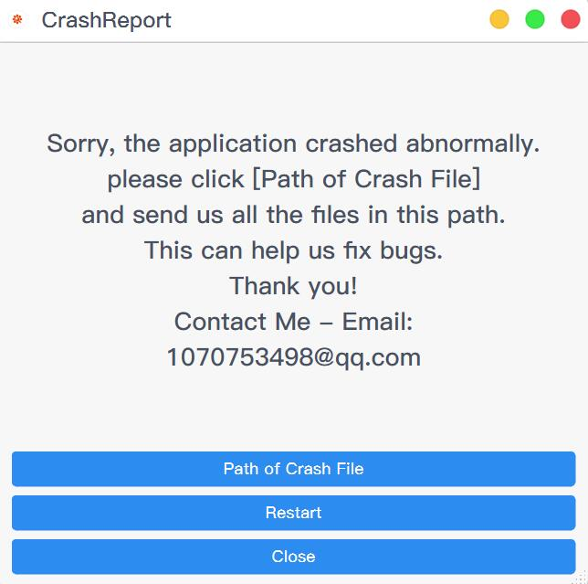

# Qt-App

-   [Simplified Chinese](README.md)
-   [English](README.en.md)

> Image resources and other sources come from the Internet.  
> This code warehouse is for learning and use only. If it is used for commercial purposes, it has nothing to do with me! Please comply with the relevant license.

## Project Introduction

Qt-App is a desktop application framework developed based on a plug-in architecture that can be used to quickly build feature-rich cross-platform desktop applications. Its core plug-in system originates from[Qt Creator](https://github.com/qt-creator/qt-creator/tree/master/src/libs/extensionsystem), and appropriate modifications were made.

Project Features:

-   🔌 Adopt a plug-in architecture to support dynamic loading and management of functional modules
-   📦Use[vcpkg](https://github.com/microsoft/vcpkg)Carry out dependency management
-   🛠️Support[CMake](.github/workflows/cmake.yml)and[QMake](.github/workflows/qmake.yml)Build the system
-   🍎 Supports Apple Silicon native compilation
-   ⚡ Integration GitHub Actions to automate compilation, packaging and publishing processes
-   🚨 Built-in crash reporting system (CrashReport)

## Project Preview

### Main application

<div align="center">

</div>

### Crash Reporting Program

<div align="center">

</div>

## Compilation and use

### use[CMake](.github/workflows/cmake.yml)Build

```bash
# 配置项目
cmake -B build -S . -DCMAKE_TOOLCHAIN_FILE=[vcpkg root]/scripts/buildsystems/vcpkg.cmake

# 编译项目
cmake --build build

# 生成翻译文件
cmake --build build --target Qt-App_lupdate
```

### use[QMake](.github/workflows/qmake.yml)Build

```bash
# 生成 Makefile
qmake Qt-App.pro

# 编译项目
make -j$(nproc)
```

## Plug-in development

Qt-App Using a plug-in system based on Qt Creator, developers can easily create their own functional plug-ins:

1.  exist`src/plugins/`Create a new plugin folder in the directory
2.  accomplish`IPlugin`interface
3.  Add plugin metadata file (`*.json`)
4.  exist`src/plugins/CMakeLists.txt`or`src/plugins/plugins.pro`Register the plugin

## Internationalization

The project supports multilingual internationalization, and the translation files are located in`translations/`Table of contents:

-   Generate translation files:`cmake --build build --target Qt-App_lupdate`
-   Publish translation files:`cmake --build build --target Qt-App_lrelease`

> Note: After changing the translation settings, you need to restart the program before it can take effect.

## Packaging and distribution

The project provides multi-platform packaging support:

-   **Windows**  
    use`packaging/windows/`The Inno Setup script builds the installer in the directory. For specific operations, please refer to[.github/workflows/cmake.yml](.github/workflows/cmake.yml)related procedures.

-   **macOS**  
    pass`packaging/macos/`The scripts in it can generate DMG images or PKG installation packages. For details on the construction method, please refer to[.github/workflows/cmake.yml](.github/workflows/cmake.yml)。

-   **Ubuntu/Debian**
    -   **Official DEB package**:based on`packaging/debian/`Configure, use`dpkg-buildpackage`Construct, refer to[.github/workflows/debian.yml](.github/workflows/debian.yml)。
    -   **Quick pack**:use`packaging/ubuntu/`Configuration Cooperation`dpkg -b`Quickly generate DEB packages, see for details[.github/workflows/cmake.yml](.github/workflows/cmake.yml)。  
        Both methods will synchronize the corresponding AppImage file.

## Notes and FAQs

### Platform-specific issues

1.  **Ubuntu Wayland**: Environment variables need to be set to solve the problem of window movement:

    ```cpp
    qputenv("QT_QPA_PLATFORM", "xcb");
    ```

2.  **macOS Bundle**: Application packages generated by CMake may need to be processed manually`PkgInfo`document

3.  **Unix system**: It is recommended to use static links to avoid dynamic library dependencies, or to set RPATH correctly

### Dependency management

1.  **vcpkg limit**: Currently vcpkg supports x64-osx and arm64-osx architectures separately, and needs to be specified explicitly:
    -   CMake:`-DCMAKE_OSX_ARCHITECTURES=x86_64`or`-DCMAKE_OSX_ARCHITECTURES=arm64`
    -   QMake:`QMAKE_APPLE_DEVICE_ARCHS=x86_64`or`QMAKE_APPLE_DEVICE_ARCHS=arm64`

2.  **Crashpad permissions**: It is necessary to ensure that under Unix systems`crashpad_handler`Have execution permissions:

    ```bash
    chmod +x crashpad_handler
    ```

## Detailed explanation of directory structure

    Qt-App/
    ├── cmake/               # CMake 实用函数封装
    ├── docs/                # 文档和图片资源
    ├── examples/            # 示例代码
    │   └── i18n/            # 国际化示例
    ├── packaging/           # 打包和发布配置
    │   ├── debian/          # Debian 官方打包（dpkg-buildpackage）
    │   ├── macos/           # DMG/PKG 安装包制作
    │   ├── ubuntu/          # Ubuntu/Debian 快速打包（dpkg -b）
    │   └── windows/         # Inno Setup 安装程序制作
    ├── src/                 # 源代码
    │   ├── 3rdparty/        # 第三方库
    │   │   ├── qtsingleapplication/  # Qt 单实例应用支持
    │   │   └── ui_watchdog/ # UI 看门狗组件
    │   ├── aggregation/     # 聚合功能模块
    │   ├── apps/            # 应用程序入口
    │   │   ├── app/         # 主应用程序
    │   │   └── crashreport/ # 崩溃报告程序
    │   ├── core/            # 核心基础模块
    │   ├── dump/            # 崩溃捕捉功能
    │   │   ├── breakpad/    # Google Breakpad 封装
    │   │   └── crashpad/    # Google Crashpad 封装
    │   ├── extensionsystem/ # 插件系统（源自 Qt Creator）
    │   ├── plugins/         # 功能插件
    │   │   ├── aboutplugin/     # 关于插件
    │   │   ├── coreplugin/      # 核心插件（主界面、菜单等）
    │   │   ├── guiplugin/       # GUI 组件插件
    │   │   ├── hashplugin/      # 哈希算法插件
    │   │   ├── helloplugin/     # Hello 测试插件
    │   │   └── systeminfoplugin/# 系统信息插件
    │   ├── resource/        # 资源文件（图标、样式表等）
    │   ├── solutions/       # 解决方案组件
    │   │   ├── spinner/     # 加载指示器
    │   │   ├── tasking/     # 任务处理
    │   │   └── terminal/    # 终端模拟
    │   ├── utils/           # 工具函数库
    │   └── widgets/         # 自定义界面组件
    ├── tests/               # 测试代码
    ├── translations/        # 国际化翻译文件
    └── 配置文件等
