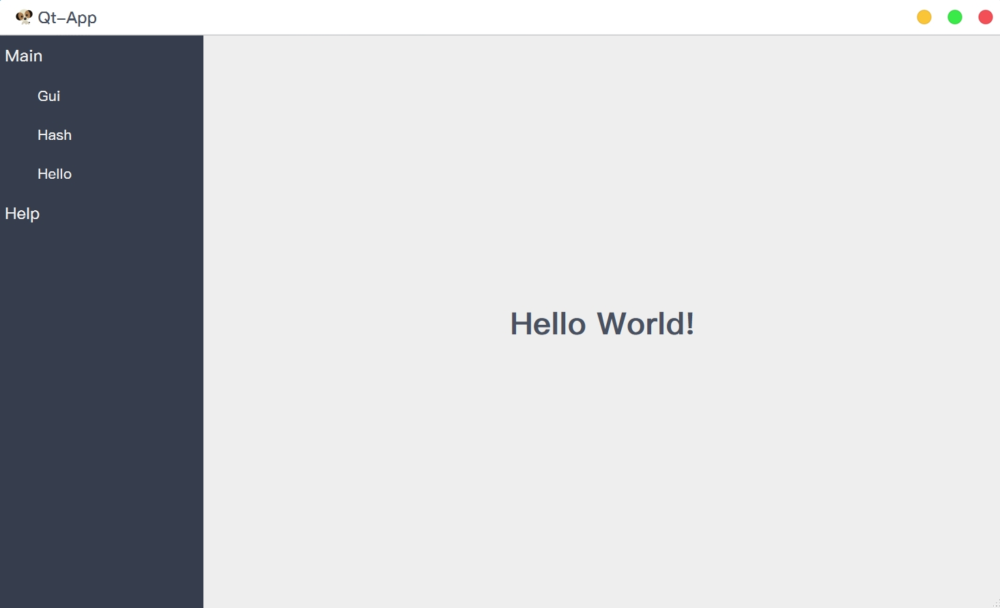

# Qt-App

-   [Simplified Chinese](README.md)
-   [English](README.en.md)

Picture resources, etc. come from the Internet.
This code repository is for learning only. If it is used for commercial purposes by others, it has nothing to do with me! Please obey the license!

## Qt-App

-   A plug-in development desktop application framework that can be used to quickly develop desktop applications;[qt-creator/src/libs/extensionsystem at master · qt-creator/qt-creator (github.com)](https://github.com/qt-creator/qt-creator/tree/master/src/libs/extensionsystem)；
-   Cooperate[vcpkg](https://github.com/microsoft/vcpkg)for use;
-   Support both[cmake](.github/workflows/cmake.yml)and[qmake](.github/workflows/qmake.yml)compile;
-   [Support Apple Silicon native compilation;](#问题和备注)
-   support[actions](.github/workflows/cmake.yml)Compile, package and publish;

<div align="center"></div>

## CrashReport

crash reporting program;

<div align="center"></div>

## Code structure

1.  [cmake](cmake): Encapsulated CMake utility function;
    1.  [utils](cmake/utils.cmake): Utility function;
2.  [doc](doc):Document description and pictures;
3.  [examples](examples):Sample code;
4.  [packaging](packaging): Packaging and publishing;
5.  [src](src): source code;
    1.  [3rdparty](src/3rdparty): Third-party library;
        1.  [qtlockedfile](src/3rdparty/qtlockedfile):Qt file lock;
        2.  [qtsingleapplication](src/3rdparty/qtsingleapplication): Qt single instance;
        3.  [breakpad](src/3rdparty/breakpad.hpp): Crash capture based on Google Breakpad package;
    2.  [aggregate](src/aggregate):polymerization;
    3.  [apps](src/apps):app;
        1.  [app](src/apps/app)：Qt-App；
        2.  [crashreport](src/apps/crashreport)：CrashReport；
    4.  [core](src/core): Plug-ins are inherited here;
    5.  [extensionsystem](src/extensionsystem): Plug-in system, the code comes from Qt-Creator, with some modifications;
    6.  [gui](src/gui): Encapsulated interface component;
    7.  [plugins](src/plugins):Plug-in;
        1.  [aboutplugin](src/plugins/aboutplugin):About the plug-in;
        2.  [coreplugin](src/plugins/coreplugin): Core plug-in, main interface, menu, toolbar, status bar, settings, plug-in manager, etc.;
        3.  [guiplugin](src/plugins/guiplugin): GUI plug-in, some GUI components customized based on QSS style;
        4.  [hashplugin](src/plugins/hashplugin): Hash plug-in, the hash algorithm provided by QT;
        5.  [helloplugin](src/plugins/helloplugin):Hello plug-in, used for testing plug-in development;
        6.  [systeminfoplugin](src/plugins/systeminfoplugin): System information plug-in;
    8.  [resource](resource): Pictures and QSS files;
    9.  [utils](utils): Tool function encapsulation;
6.  [translations](translations):translate a file;

## Questions and comments

-   MacOS, the bundle generated by cmake is not generated in the .app/Contents/ folder.`PkgInfo`document;
    1.  [app/CMakeLists](/apps/app/CMakeLists.txt), using this CMakeLists.txt, you can generate a bundle on MacOS and the icon can be displayed normally, but there is no PkgInfo file;
    2.  How does cmake generate PkgInfo files?
        1.  WireShark use`set_source_files_properties(${CMAKE_CURRENT_SOURCE_DIR}/PkgInfo PROPERTIES MACOSX_PACKAGE_LOCATION .)`Similar to this method, copy it to the bundle;
    3.  qmake will generate a PkgInfo file by default, you only need to specify`TARGET=app`or`CONFIG+=bundle`That’s it;

-   Under Unix systems, you need to use static libraries as much as possible to avoid dependence on dynamic libraries;
    1.  Several modules in this project are dynamic libraries, and because they are plugins, they need to be loaded dynamically;
    2.  Then you need to package these dynamic libraries and load them at runtime. You also need to modify the rpath`"-Wl,-rpath,\'\$$ORIGIN\':\'\$$ORIGIN/lib\':'\$$ORIGIN/../lib'")`，进行设置，否则会找不到动态库；
    3.  Or use install_name_tool (macos), patchelf/chrpath (linux) to modify the dependency path of the dynamic library, which is very troublesome;
    4.  Also consider that these libraries can be shared, so do not package them repeatedly;
    5.  For details, please see[workflows](.github/workflows/cmake.yml)；

-   MacOS，[vcpkg](https://github.com/microsoft/vcpkg)Issues with compiling third-party libraries;
    1.  because[vcpkg](https://github.com/microsoft/vcpkg)at present[Only supports separate compilation of x64-osx and arm64-osx](https://github.com/microsoft/vcpkg/discussions/19454)；
    2.  In use[cmake](.github/workflows/cmake.yml), you need to specify`CMAKE_OSX_ARCHITECTURES=x86_64`or`CMAKE_OSX_ARCHITECTURES=arm64`;
    3.  In use[qmake](.github/workflows/qmake.yml), you need to specify`QMAKE_APPLE_DEVICE_ARCHS=x86_64`or`QMAKE_APPLE_DEVICE_ARCHS=arm64`；

-   Why not use google crashpad as crash capture module?
    1.  [vcpkg](https://github.com/microsoft/vcpkg)right[crashpad](https://github.com/chromium/crashpad)exist`macos`and`linux`Poor support;
    2.  If you want to use[crashpad](https://github.com/chromium/crashpad)，[Reference Code](https://github.com/RealChuan/Cpp-Examples/tree/master/Crashpad);

-   International real-time translation. After changing the translation settings, you need to restart the program to take effect;

    1.  Too lazy to change the code;
    2.  [Specific reference: QT practical tips (update as soon as I think of it)](https://realchuan.github.io/2021/10/12/QT%E5%AE%9E%E7%94%A8%E5%B0%8F%E6%8A%80%E5%B7%A7%EF%BC%88%E6%83%B3%E5%88%B0%E5%B0%B1%E6%9B%B4%E6%96%B0%EF%BC%89/), core code;

        ```cpp
        void Widget::changeEvent(QEvent *e)
        {
           QWidget::changeEvent(e);
           switch (e->type()) {
           case QEvent::LanguageChange:
              comboBox->setItemText(0, tr("Hello"));
              label->setText(tr("Hello")); // 代码添加的文字
              ui->retranslateUi(this);     // 有UI文件情况下
              break;
           default: break;
           }
        }
        ```
