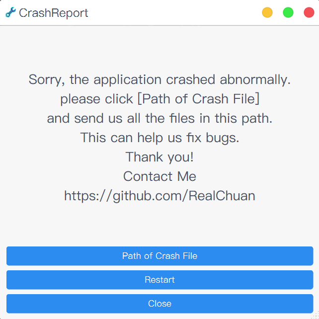

# Qt-App

-   [Simplified Chinese](README.md)
-   [English](README.en.md)

> Image resources and other sources come from the Internet.  
> This code warehouse is for learning and use only. If it is used for commercial purposes, it has nothing to do with me! Please comply with the relevant license.

## Project Introduction

Qt-App is a desktop application framework developed based on a plug-in architecture that can be used to quickly build feature-rich cross-platform desktop applications. Its core plug-in system originates from[Qt Creator](https://github.com/qt-creator/qt-creator/tree/master/src/libs/extensionsystem), and appropriate modifications were made.

-   🔌**Plug-in architecture**- Support dynamic loading and flexible management of functional modules
-   🛠️**Dual build system support**- Integration at the same time[CMake](.github/workflows/cmake.yml)and[QMake](.github/workflows/qmake.yml), adapt to different development needs
-   📦**Unified dependency management**- based on[vcpkg](https://github.com/microsoft/vcpkg)Manage project dependencies and simplify environment configuration
-   🍎**Cross-architecture macOS support**- Compile and merge into common binary files for Apple Silicon and Intel architectures
-   ⚡**Automation CI/CD**- Automatic compilation, packaging and publishing through GitHub Actions
-   🚨**Crash reporting system**- built-in[CrashReport](src/apps/crashreport/)Mechanism for easy problem tracking and repair

## Project Preview

### Main application

<div align="center">

</div>

### 崩溃报告程序

<div align="center">

</div>

## Compilation and use

### [CMake](.github/workflows/cmake.yml)Build

### [QMake](.github/workflows/qmake.yml)Build

## Plug-in development

Qt-App Using a plug-in system based on Qt Creator, developers can easily create their own functional plug-ins:

1.  exist`src/plugins/`Create a new plugin folder in the directory
2.  accomplish`IPlugin`interface
3.  Add plugin metadata file (`*.json`)
4.  exist`src/plugins/CMakeLists.txt`or`src/plugins/plugins.pro`Register the plugin

## Internationalization

The project supports multilingual internationalization, and the translation files are located in`translations/`Table of contents:

### Translation file management

-   **Generate translation files**：`cmake --build build --target Qt-App_lupdate`
-   **Publish translation files**：`cmake --build build --target Qt-App_lrelease`

### Real-time translation support

> Note: After changing the translation settings, you need to restart the program before it can take effect.

If you need to implement real-time translation switching, you can add language change event processing to the code:

```cpp
void Widget::changeEvent(QEvent *e)
{
   QWidget::changeEvent(e);
   switch (e->type()) {
   case QEvent::LanguageChange:
      comboBox->setItemText(0, tr("Hello"));
      label->setText(tr("Hello")); // 代码添加的文字
      ui->retranslateUi(this);     // 有UI文件情况下
      break;
   default: break;
   }
}
```

For more internationalization skills, please refer to:[Practical QT tips](https://realchuan.github.io/2021/10/12/QT%E5%AE%9E%E7%94%A8%E5%B0%8F%E6%8A%80%E5%B7%A7%EF%BC%88%E6%83%B3%E5%88%B0%E5%B0%B1%E6%9B%B4%E6%96%B0%EF%BC%89/)

## Packaging and distribution

The project provides multi-platform packaging support:

-   **Windows**  
    use`packaging/windows/`The Inno Setup script builds the installer in the directory. For specific operations, please refer to[.github/workflows/cmake.yml](.github/workflows/cmake.yml)related procedures.

-   **macOS**  
    pass`packaging/macos/`The scripts in it can generate DMG images or PKG installation packages. For details on the construction method, please refer to[.github/workflows/cmake.yml](.github/workflows/cmake.yml)。

-   **Ubuntu/Debian**
    -   **Official DEB package**:based on`packaging/debian/`Configure, use`dpkg-buildpackage`Construct, refer to[.github/workflows/debian.yml](.github/workflows/debian.yml)。
    -   **Quick pack**:use`packaging/ubuntu/`Configuration Cooperation`dpkg -b`Quickly generate DEB packages, see for details[.github/workflows/cmake.yml](.github/workflows/cmake.yml)。  
        Both methods will synchronize the corresponding AppImage file.

## Notes and FAQs

### Platform-specific issues

1.  **Ubuntu Wayland**: Environment variables need to be set to solve the problem of window movement:

    ```cpp
    qputenv("QT_QPA_PLATFORM", "xcb");
    ```

2.  **macOS Bundle**: Application packages generated by CMake may need to be processed manually`PkgInfo`document

3.  **macOS code signature**: Packaged applications may require ad-hoc signature to run properly to avoid`EXC_BAD_ACCESS (SIGKILL (Code Signature Invalid))`mistake:

    ```bash
    # 对应用程序进行 ad-hoc 签名
    codesign --force --deep --sign - /path/to/Qt-App.app

    # 或者对 DMG 包中的应用程序签名
    codesign --force --deep --sign - /Volumes/Qt-App/Qt-App.app
    ```

4.  **Unix system**: It is recommended to use static links to avoid dynamic library dependencies, or to set RPATH correctly

### Dependency management and cross-platform construction

because[vcpkg](https://github.com/microsoft/vcpkg)Apple Universal binary compilation is not supported yet. The macOS platform needs to compile different architecture versions separately:

**macOS cross-architecture construction solution:**

-   Compile x86_64 and arm64 versions respectively
-   use`lipo`The tools are merged into general binary files, for specific implementations, please refer to[merge_universal_app](packaging/macos/universal/merge_universal_app.sh)

**Schema Specification Method:**

-   **CMake**: use`-DCMAKE_OSX_ARCHITECTURES=x86_64`or`-DCMAKE_OSX_ARCHITECTURES=arm64`
-   **QMake**: use`QMAKE_APPLE_DEVICE_ARCHS=x86_64`or`QMAKE_APPLE_DEVICE_ARCHS=arm64`

**Other notes:**

-   **Crashpad permissions**: It is necessary to ensure that under Unix systems`crashpad_handler`Have execution permissions:

    ```bash
    chmod +x crashpad_handler
    ```
