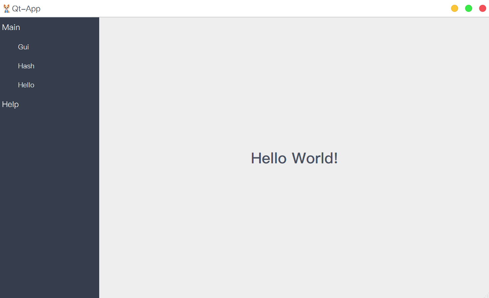
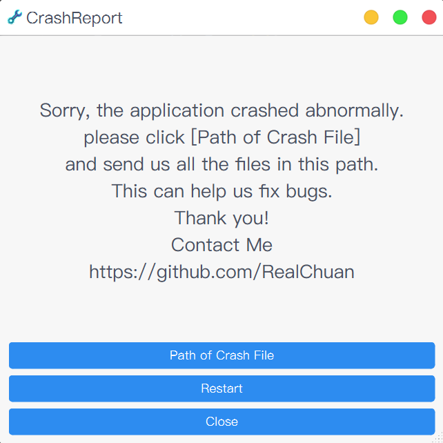

# Qt-App

- [简体中文](README.md)
- [English](README.en.md)

> 图片资源等来自于互联网。  
> 本代码仓库仅供学习使用，若被用于商业用途与本人无关！请遵守相关许可证。

## 项目简介

Qt-App 是一个基于插件式架构开发的桌面应用程序框架，可用于快速构建功能丰富的跨平台桌面应用。其核心插件系统源自 [Qt Creator](https://github.com/qt-creator/qt-creator/tree/master/src/libs/extensionsystem)，并进行了适当修改。

- 🔌 **插件化架构** - 支持功能模块的动态加载与灵活管理
- 🛠️ **双构建系统支持** - 同时集成 [CMake](.github/workflows/cmake.yml) 与 [QMake](.github/workflows/qmake.yml)，适应不同开发需求
- 📦 **统一依赖管理** - 基于 [vcpkg](https://github.com/microsoft/vcpkg) 管理项目依赖，简化环境配置
- 🍎 **跨架构 macOS 支持** - 针对 Apple Silicon 和 Intel 架构，通过分别编译并合并为通用二进制文件
- ⚡ **自动化 CI/CD** - 通过 GitHub Actions 实现自动编译、打包与发布
- 🚨 **崩溃报告系统** - 内置 [CrashReport](src/apps/crashreport/) 机制，便于问题追踪与修复

## 项目预览

### 主应用程序

<div align="center">

</div>

### 崩溃报告程序

<div align="center">

</div>

## 编译与使用

### [CMake](.github/workflows/cmake.yml) 构建

### [QMake](.github/workflows/qmake.yml) 构建

## 插件开发

Qt-App 使用基于 Qt Creator 的插件系统，开发者可以轻松创建自己的功能插件：

1. 在 `src/plugins/` 目录下创建新插件文件夹
2. 实现 `IPlugin` 接口
3. 添加插件元数据文件 (`*.json`)
4. 在 `src/plugins/CMakeLists.txt` 或 `src/plugins/plugins.pro` 中注册插件

## 国际化

项目支持多语言国际化，翻译文件位于 `translations/` 目录：

### 翻译文件管理

- **生成翻译文件**：`cmake --build build --target Qt-App_lupdate`
- **发布翻译文件**：`cmake --build build --target Qt-App_lrelease`

### 实时翻译支持
>
> 注意：当前更改翻译设置后需要重启程序才能生效

如需实现实时翻译切换，可在代码中添加语言变更事件处理：

```cpp
void Widget::changeEvent(QEvent *e)
{
   QWidget::changeEvent(e);
   switch (e->type()) {
   case QEvent::LanguageChange:
      comboBox->setItemText(0, tr("Hello"));
      label->setText(tr("Hello")); // 代码添加的文字
      ui->retranslateUi(this);     // 有UI文件情况下
      break;
   default: break;
   }
}
```

更多国际化技巧请参考：[QT实用小技巧](https://realchuan.github.io/2021/10/12/QT%E5%AE%9E%E7%94%A8%E5%B0%8F%E6%8A%80%E5%B7%A7%EF%BC%88%E6%83%B3%E5%88%B0%E5%B0%B1%E6%9B%B4%E6%96%B0%EF%BC%89/)

## 打包与分发

项目提供了多平台打包支持：

- **Windows**  
  使用 `packaging/windows/` 目录下的 Inno Setup 脚本构建安装程序。具体操作可参考 [.github/workflows/cmake.yml](.github/workflows/cmake.yml) 中的相关流程。

- **macOS**  
  通过 `packaging/macos/` 中的脚本可生成 DMG 镜像或 PKG 安装包。构建方法详见 [.github/workflows/cmake.yml](.github/workflows/cmake.yml)。

- **Ubuntu/Debian**  
  - **官方 DEB 包**：基于 `packaging/debian/` 配置，使用 `dpkg-buildpackage` 进行构建，参考 [.github/workflows/debian.yml](.github/workflows/debian.yml)。
  - **快速打包**：使用 `packaging/ubuntu/` 配置配合 `dpkg -b` 快速生成 DEB 包，详见 [.github/workflows/cmake.yml](.github/workflows/cmake.yml)。  
  两种方式均会同步生成对应的 AppImage 文件。

## 注意事项与常见问题

### 平台特定问题

1. **Ubuntu Wayland**: 需要设置环境变量解决窗口移动问题：

   ```cpp
   qputenv("QT_QPA_PLATFORM", "xcb");
   ```

2. **macOS Bundle**: CMake 生成的应用程序包可能需要手动处理 `PkgInfo` 文件

3. **macOS 代码签名**: 打包后的应用程序可能需要 ad-hoc 签名才能正常运行，避免出现 `EXC_BAD_ACCESS (SIGKILL (Code Signature Invalid))` 错误：

   ```bash
   # 对应用程序进行 ad-hoc 签名
   codesign --force --deep --sign - /path/to/Qt-App.app
   
   # 或者对 DMG 包中的应用程序签名
   codesign --force --deep --sign - /Volumes/Qt-App/Qt-App.app
   ```

4. **Unix 系统**: 建议使用静态链接避免动态库依赖问题，或正确设置 RPATH

### 依赖管理与跨平台构建

由于 [vcpkg](https://github.com/microsoft/vcpkg) 暂不支持 Apple Universal 二进制编译，macOS 平台需要分别编译不同架构版本：

**macOS 跨架构构建方案：**

- 分别编译 x86_64 和 arm64 版本
- 使用 `lipo` 工具合并为通用二进制文件，具体实现可参考[merge_universal_app](packaging/macos/universal/merge_universal_app.sh)

**架构指定方法：**

- **CMake**: 使用 `-DCMAKE_OSX_ARCHITECTURES=x86_64` 或 `-DCMAKE_OSX_ARCHITECTURES=arm64`
- **QMake**: 使用 `QMAKE_APPLE_DEVICE_ARCHS=x86_64` 或 `QMAKE_APPLE_DEVICE_ARCHS=arm64`

**其他注意事项：**

- **Crashpad 权限**: 在 Unix 系统下需要确保 `crashpad_handler` 有执行权限：

  ```bash
  chmod +x crashpad_handler
  ```
